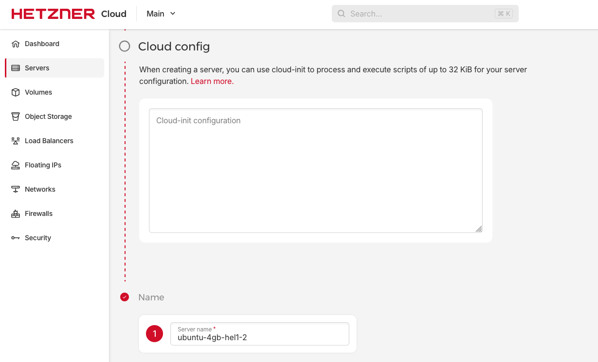

# Simple cloud init files for ZaneOps

You can use these `cloud-init` files to setup your server with zaneops, for that you need to copy the file in `cloud-init.yaml` (or `cloud-init-with-omz.yaml` if you want to use `oh-my-zsh`) into the cloud config textarea on your server provider :

> [!WARNING]
> These cloud-config use the default user to setup, on some providers, the default user is `root` which is not recommended for security purposes. Check with your provider to be sure.